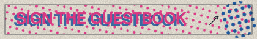

<div align="center">
  
</div>

---

```bash
$ whoami
httprity — Product Designer · AI/ML Developer

$ cat skills.txt
figma, react, typescript, python, pytorch, llms/rag, fastapi, godot

$ uptime
up since 2025 · Dhaka, BD · load: deshly-studio, agrisense, iccit-2026-paper

$ contact --all
→ httprityportfolio.vercel.app   haquesamprity4@gmail.com   in/hsamprity
```

<a href="https://httprityportfolio.vercel.app/">
  
</a>

I'm a product designer and AI developer who likes being involved in the entire journey — from finding the problem and shaping the product to designing, building, and making technology feel a little more human.

<p align="center">
  <a href="https://httprityportfolio.vercel.app/">portfolio</a> ·
  <a href="https://github.com/httprity">github</a> ·
  <a href="https://www.linkedin.com/in/hsamprity">linkedin</a> ·
  <a href="mailto:haquesamprity4@gmail.com">email</a> ·
  <a href="#07--guestbook">sign the guestbook ✍️</a>
</p>


## 01 / Expertise

*Four disciplines. One connected practice.* I like working across the layers of a product — from the problem and experience to the technology underneath it. **Click a discipline to expand it.**

<details>
<summary><b>▧ &nbsp;01 · Product</b> — <i>shape the experience</i></summary>
<br>

| | |
|---|---|
| **UI/UX Design** | Figma, user flows, SaaS interfaces, dashboards, landing pages, visual hierarchy |
| **Product Design & Strategy** | Problem discovery, feature planning, MVP definition, product workflows |
| **Figma & Visual Design** | Interface design, typography, composition, design-to-development handoff |
| **Product Research** | User problems, competitor analysis, solution validation, product opportunities |

</details>

<details>
<summary><b>✳ &nbsp;02 · AI & ML</b> — <i>make intelligence useful</i></summary>
<br>

| | |
|---|---|
| **Machine Learning** | Model training, experimentation, inference, evaluation |
| **ML Model Integration** | Deploying models into applications, inference pipelines, connecting models with APIs |
| **LLM Development** | RAG, AI agents, prompting, structured LLM workflows |
| **AI/ML Research & Evaluation** | Model comparison, quantization, evaluation methodology, statistical analysis |

</details>

<details>
<summary><b>&lt;/&gt; &nbsp;03 · Development</b> — <i>bring the idea to life</i></summary>
<br>

| | |
|---|---|
| **Frontend Development** | HTML, CSS, JavaScript, modern web development |
| **React & TypeScript** | React, TypeScript, Vite, Tailwind CSS, component-based development |
| **AI-Native Development** | Claude Code, AI-assisted coding, debugging, implementation and iteration |
| **Backend & API Integration** | REST APIs, FastAPI, databases, AI API integration |

</details>

<details>
<summary><b>⌖ &nbsp;04 · Research & Problem Solving</b> — <i>ask better questions</i></summary>
<br>

| | |
|---|---|
| **Problem Discovery** | Finding the actual problem before designing the solution |
| **Experimentation** | Building small things to test bigger ideas |
| **AI Evaluation** | Understanding where models work, fail, and why |
| **Systems Thinking** | Connecting product decisions with the technology behind them |

</details>


## 02 / Selected work

*Things I've built, designed, and experimented with — products where design, software, and AI meet real problems.* **Click a project to open it.**

<details>
<summary><b>P/001 · Deshly Studio</b> — AI product photography that preserves identity and keeps campaigns editable.</summary>
<br>

`Product` `Computer Vision` `AI` `3D`

Diaspora marketing intelligence for Bangladeshi D2C brands, pivoted into an AI product-photography studio: generate campaign imagery that keeps the *actual* product's identity intact, and keep every shot editable instead of one-shot.

→ [Case study](https://httprityportfolio.vercel.app/work/deshly) · [Code](https://github.com/httprity/deshly)

</details>

<details>
<summary><b>P/002 · AgriSense AI</b> — Turns a farmer's needs into grounded, actionable season plans.</summary>
<br>

`AI` `RAG` `Agriculture` `Decision Support`

An agent that takes a farmer from an empty field to a costed, weather-aware season plan — and keeps advising through harvest. Built with a grounded RAG pipeline over agronomy sources so the advice cites, not guesses.

→ [Case study](https://httprityportfolio.vercel.app/work/agrisense) · [Code](https://github.com/httprity/httprity_Agrisense)

</details>

<details>
<summary><b>P/003 · Bikolpo</b> — Predicts rain-disrupted trips and finds safer alternatives.</summary>
<br>

`Geospatial AI` `Routing` `Climate`

An AI-powered safe routing engine for urban floods in Dhaka 🌧️🚗. Instead of only finding the fastest route, Bikolpo finds the *safest* one by predicting which road segments are likely to flood and re-weighting routes accordingly.

→ [Case study](https://httprityportfolio.vercel.app/work/bikolpo) · [Code](https://github.com/httprity/Bikolpo-AI-Powered-Safe-Routing-Engine)

</details>

<details>
<summary><b>P/004 · SafaiTrack</b> — Sensor-free waste collection powered by forecasting, routing, and grounded AI.</summary>
<br>

`Forecasting` `Optimization` `Civic Tech`

Waste-collection planning for cities that can't afford bin sensors: forecast fill levels from history, optimise the collection route, and explain the plan through a grounded assistant.

→ [Case study](https://httprityportfolio.vercel.app/work/safaitrack) · [Code](https://github.com/fairuz-anadi/SafaiTrack)

</details>

<details>
<summary><b>P/005 · Markable</b> — Reveals hidden inconsistencies in human marking without replacing teachers.</summary>
<br>

`AI` `Education` `Evaluation` `Human-AI`

An evaluation tool that surfaces where a teacher's grading drifts between scripts — a second pair of eyes on the marking, not a replacement for the marker.

→ [Case study](https://httprityportfolio.vercel.app/work/markable)

</details>


## 03 / Experience

**Expresso Soft** — UI/UX Designer · *Sep 2025 — present*<br>
Designing digital products and web experiences across SaaS, landing pages, and template products — while increasingly working across the boundary between design and implementation.

**Expresso Soft** — UI/UX Intern · *Jun 2025 — Sep 2025*

## 04 / Achievements

| | Result | Event |
|:-:|---|---|
| 01 | **2nd Runner-Up** | IUT 12th ICT Fest — GameJam |
| 02 | **Top 20 / 700+** | IUT 12th ICT Fest — Hackathon |
| 03 | **Finalist** | VisionX 2025 — National AI-Powered Innovation Challenge |
| 04 | **Finalist** | The Infinity AI BuildFest 2026 |


## 05 / A little about me

*I'm interested in what happens between an idea and a finished product.*

I'm a Computer Science & Engineering student at Ahsanullah University of Science & Technology. I started with design, moved deeper into development and AI, and eventually realised that I enjoy the space between all three.

I like understanding the problem, designing the experience, building the system, and then asking whether it actually works.

```javascript
const developer = {
    name: "Samprity Haque",
    role: "Product Designer · AI/ML Developer",
    location: "Dhaka, Bangladesh",
    education: "CSE @ Ahsanullah University of Science & Technology",
    code: ["Python", "TypeScript", "JavaScript", "C++"],
    technologies: {
        design: ["Figma", "User flows", "Design systems", "Prototyping"],
        frontEnd: {
            js: ["React", "Next.js", "Vite"],
            css: ["Tailwind CSS"]
        },
        backEnd: {
            python: ["FastAPI"],
            apis: ["REST", "Claude API", "Gemini API"]
        },
        aiMl: {
            core: ["PyTorch", "Model training & evaluation"],
            llm: ["RAG", "AI agents", "Prompting"],
            research: ["Quantization", "Evaluation methodology"]
        },
        tools: ["Claude Code", "Git", "Godot"]
    },
    currentFocus: "Computer vision & AI product development",
    funFact: "Started in Figma, ended up training models 🤷🏻‍♀️"
};
```

**Currently exploring:** Computer Vision · AI Product Development · Machine Learning · Product Engineering

<details>
<summary><b>📊 GitHub stats</b></summary>
<br>
<p align="center">
  
  
</p>
</details>


## 06 / Let's talk

**Have something worth building?_**

I'm interested in ambitious products, difficult problems, and opportunities where I can design, build, and learn.

— [haquesamprity4@gmail.com](mailto:haquesamprity4@gmail.com) · [linkedin](https://www.linkedin.com/in/hsamprity) · [httprityportfolio.vercel.app](https://httprityportfolio.vercel.app/)


## 07 / Guestbook

Leave a note — it gets printed onto this page by a bot within a minute. Click the stamp, write a line, submit the issue.

<p align="center">
  <a href="https://github.com/httprity/httprity/issues/new?template=guestbook.yml">
    
  </a>
</p>

<!-- GUESTBOOK:START -->
| Visitor | Note | Stamped |
|---|---|---|
| [@httprity](https://github.com/httprity) | First print off the press. Sign below 🩷 | 2026-09-19 |
<!-- GUESTBOOK:END -->

<p align="center"><sub>RISO 2-COLOUR · FLUORO PINK 1017 + FEDERAL BLUE 1023 · EDITION OF 1</sub></p>
